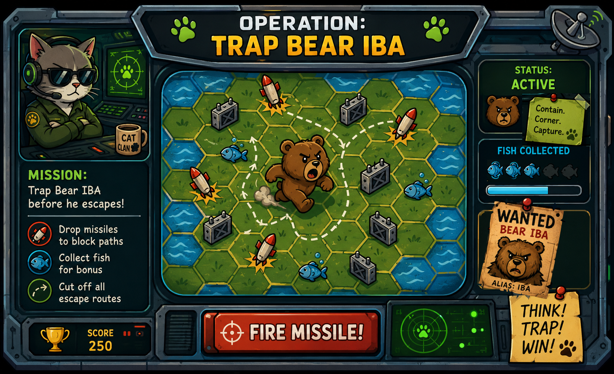
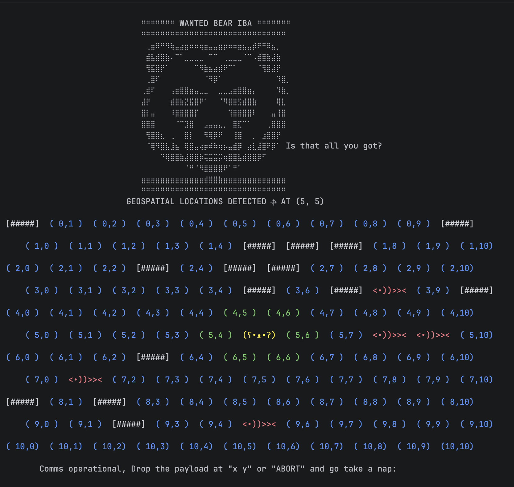

# Operation: Trap Bear

<p align="center">
  
  <br>
  <em>Mission Briefing</em>
</p>

A CLI strategy game where an escaped bear uses pathfinding to find the shortest route out of the grid while you try to trap it before it reaches the edge.

The game combines simple mechanics with surprisingly strategic gameplay. Every turn matters. One misplaced missile can open an escape route you didn’t even notice.

## Overview

Codename `IBA` has escaped containment and is moving through a geospatial grid. Your job is to deploy missile barriers and cut off every possible path before the bear reaches the perimeter.

If you fail & it reaches the border, the Cat Clan's entire network goes dark.

The twist is that the bear is not moving randomly.

Each turn, it runs a Breadth-First Search (BFS) to calculate the shortest available path to freedom. If an opening exists, it will find it.

The game is played entirely in the terminal using an 11x11 grid that behaves like a hexagonal board rather than a normal square grid.


## Gameplay

<p align="center">
  
  <br>
  <em>Live Gameplay</em>
</p>

- Drop missile barriers using coordinate inputs ` x y `
- Do not let the bear reach the border perimeter tile
- Collect fish for bonus points
- Use positioning and prediction rather than brute force

### The board begins:

- `[#####]` - Random 15 missile obstacles
- `<•))>><` - Random 0-5 fish spawns 
- `(ʕ•ᴥ•ʔ)` - Bear IBA starting at the central containment unit `(5,5)`

### After every move:

- You place a missile barrier on the geospatial grid
- The bear recalculates and senses the shortest escape route
- The bear moves one step closer to freedom

### The mission ends:

- Target secure - The bear is completely trapped
- Target lost - TThe bear slips through the perimeter and escapes
- Abort - You abort the mission and tactically retreat to the shadows

## Pathfinding

The bear uses its exceptionally strong sense of smell (BFS) to sniff out the shortest possible route to freedom.

- Searches all reachable paths
- Finds the nearest border cell to freedom
- Avoids blocked positions

## Installation

Clone the repository and run:
```
python main.py

or

./dist/main
```
No external dependencies are required.

## Agent Stats & Leaderboard
Compete with your friends, climb the global Cat Clan rankings, and build your reputation across successful operations.

Track:

- Total Fish Points
- Successful missions
- Overall performance rating

All progress is saved automatically, allowing you to level up your agent profile over time and compare your stats against other operatives on the leaderboard.


## Easter Eggs 🥚

The game contains a few hidden Easter eggs. Try finding them before reading below:

- **Bears not allowed** - Usernames starting with bear are not permitted.
- **Bears are smarter** — The agent name `raeb` (`bear` reversed) inverts the missile system and helps Bear IBA escape by breaking barriers instead of placing them.
- **Movie references** — Extremely large coordinates trigger hidden pop-culture transmissions and movie references.
- **Shutdown** — The self-destruct sequence contains a hidden Mission Impossible reference and a concealed `BEAR-TRAP` message.